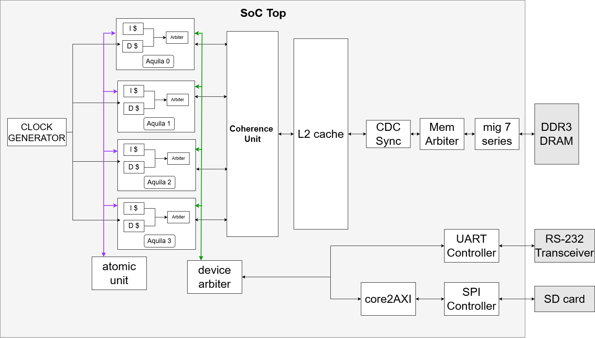
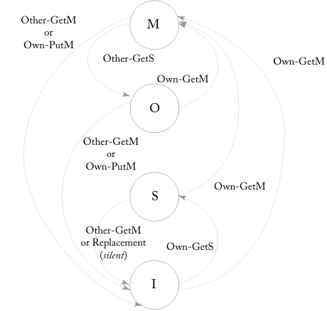

# Overview  
This project focuses on verifying and simplifying the coherence circuit design of a dual-core system extended from a RISC-V 5-stage pipelined processor, originally developed by the Embedded Intelligent System Lab (EISL).  

The goal is to expand the RISC-V 5-stage pipelined processor to a quad-core system using the MOSI protocol.  

## Expected Artifacts
1. **Architecture Diagram**  
   - The anticipated quad-core architecture is shown below:

   

2. **MOSI FSM Diagram**  
   - The MOSI protocol's FSM is visualized below:

   

## Completed Work
**Coherence Verification**, **Shared Memory Testing**,  **UART Boot Code and Linker Script Modification**, **Mutex Logic Modification**  
---

## Current Work
1. **Module Design Documentation**  
   - Developing a detailed block diagram, FSM (Finite State Machine), and timing diagram for modules in the quad-core design.

2. **System Verification**  
   - Verifying the redesigned system to ensure it adheres to the MOSI protocol and performs reliably under quad-core operation.

---

## TODO
1. **Implementation** ,**Unit Testing** ,**Design Unification**, **software run on quad core design**
---

---

## Source Code  
Aquila's source code is available on GitHub: [Aquila GitHub Repository](https://github.com/eisl-nctu/aquila)  

---

### Folder and File Descriptions

#### sw/  
- **coremark_2core/** – Test with CoreMark for dual-core performance evaluation  
- **elibc/** – Basic C header library  
- **ocr_1core/** – MLP handwriting recognition evaluation code for single core  
- **ocr_2core/** – Evaluation code for dual core running in parallel  
- **test/** – Shared memory test cases  
- **uartboot/** – Contains both the original and modified UART boot code for the Arty A7-100T board  

#### hw/  
- **aquila_arty/aquila_arty.srcs/** – Source code of the dual-core system