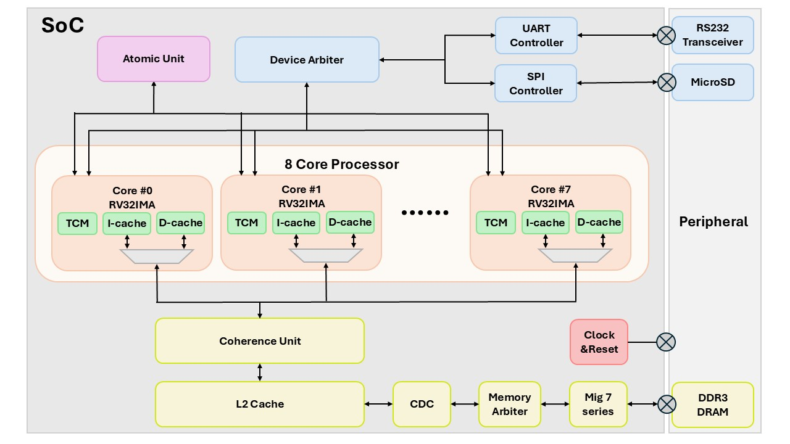
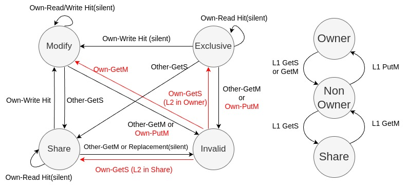

# The Aquila multi-Core RISC-V SoC

---

Aquila-MP is an open-source multi-core (at most 8 core) system-on-chip featuring a 32-bit RISC-V RV32IMA processor, extended by the [Aquila SoC](https://github.com/eisl-nctu/aquila). It employs the MESI cache coherence protocol to maintain data consistency across L1 and L2 caches in a shared memory system. The processor supports atomic instructions for efficient synchronization and mutual exclusion in multicore environments. Developed using Verilog HDL, the system is synthesized with the Xilinx Vivado toolchain and operates on the Arty A7-100T and Kintex-7 325T FPGA board.

---

## **Specification**

Current features of the Aquila-Quad SoC include:

- RV32IMA ISA-compliant.
- Embedded 16KB tightly-coupled on-chip memory (TCM).
- 16KB L1 data and instruction caches.
- 64KB L2 cache shared among four cores.
- Multi-core support with coherent data cache controller.
- Can switch between 2, 4, and 8 cores using configurable parameters in the RTL design.
- CLINT for standard timer interrupts.
- The RTL model written in Verilog.
- SD card I/O support.

---

## **Performance**
Performance is evaluated using an MLP-based MNIST handwritten digit recognition task and a parallel matrix multiplication task, achieving 7.27x and 7.53x speed-ups, respectively, compared to the original Aquila SoC. Aquila-Quad delivers 2.01 CoreMark/MHz and 0.86 DMIPS/MHz per core and runs at 50 MHz on a Xilinx Artix-7 and Kintex-7 FPGA.

## **MESI FSM Diagram**  
The MESI protocol's FSM is visualized below:  

---

## **User's Guide**
For detailed instructions on how to set up and use the Aquila-Quad SoC, please refer to the [User's Guide](user_guide.md).
---

## **Acknowledgment**  
Aquila's source code is available on GitHub: [Aquila GitHub Repository](https://github.com/eisl-nctu/aquila)

The quad-core system is extended by contributions from the Embedded Intelligent Systems Laboratory (EISL) at National Chiao Tung University (NCTU). We acknowledge the support and collaboration from the open-source community and our academic partners.

## **Current Work**
Integration of a Memory Management Unit (MMU) to enable Linux OS support.
---

## **Folder and File Descriptions**

### **sw/**  
- **elibc/** – Basic C header library  
- **ocr_4core/** – Evaluation code for multi-core running in parallel  
- **matrix/** – Matrix multiplication evaluation code for multi-core
- **sorting/** – Array sorting evaluation code for multi-core
- **sw_templates/** – Template sw code for the Aquila SoC
- **uartboot/** – Contains UART boot code 

### **src/**  
- **mem/** – Contains the uartboot code that can be compiled in `sw/uartboot`
- **soc_rtl/** – Contains the top-level RTL code for the Aquila SoC  

### **build_arty100.tcl**
- Script to build the Aquila-Quad SoC on the Arty A7-100T board

## **build_qmcore.tcl**
- Script to build the Aquila-Quad SoC on the Kintex-7 325T board