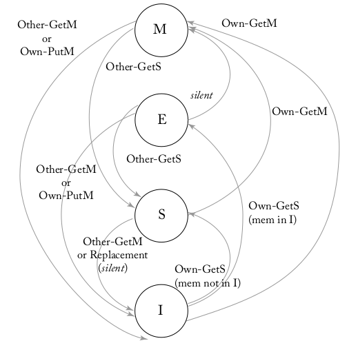

# **Project Overview**  
This project focuses on verifying and simplifying the coherence circuit design of a dual-core system extended from a RISC-V 5-stage pipelined processor, originally developed by the Embedded Intelligent System Lab (EISL).  

The goal is to expand the RISC-V 5-stage pipelined processor to a quad-core system using the MESI protocol.  

---

## **Expected Artifacts**

### 1. **Architecture Diagram**  
The anticipated quad-core architecture is shown below:  

### 2. **MESI FSM Diagram**  
The MESI protocol's FSM is visualized below:  

---

## **Completed Work**
1. Coherence verification and shared memory testing  
2. UART boot code and linker script modification, mutex logic modification  
3. Core version update  
4. L1 D-cache FSM, code, and unit test (simulation) complete  
5. Coherence unit FSM and code complete  
6. L1/L2 cache and coherence unit port design complete  

---

## **Current Work**
1. Coherence unit testbench  
2. L2 cache RTL code and testbench integration  
3. Coherence unit and L1/L2 D-cache integration  
4. Integration of other RTL code and testbenches  
5. Running software on the quad-core design  

---

## **Source Code**  
Aquila's source code is available on GitHub: [Aquila GitHub Repository](https://github.com/eisl-nctu/aquila)  

---

## **Folder and File Descriptions**

### **sw/**  
- **coremark_2core/** – Test with CoreMark for dual-core performance evaluation  
- **elibc/** – Basic C header library  
- **ocr_1core/** – MLP handwriting recognition evaluation code for single core  
- **ocr_2core/** – Evaluation code for dual-core running in parallel  
- **test/** – Shared memory test cases  
- **uartboot/** – Contains both the original and modified UART boot code for the Arty A7-100T board  

### **hw/**  
- **aquila_arty/aquila_arty.srcs/sources_1/imports/src**  
  - **core_rtl/** – Contains the core RTL code for the RISC-V 5-stage pipelined processor  
  - **l1_cache/** – Contains the L1 D-cache RTL code and testbench (current work)  
  - **soc_rtl/** – Contains the top-level RTL code for the Aquila SoC  

- **aquila_arty/aquila_arty.srcs/sim_1/imports/soc_rtl**  
  - **soc_tb.v** – Testbench for the Aquila SoC  
